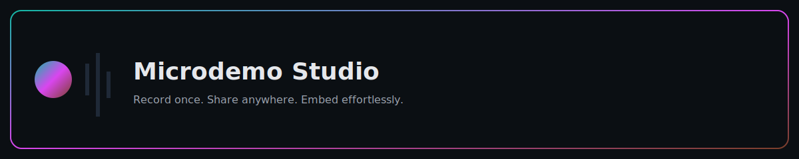

<p align="center">
  
  <br/>
  <a href="https://github.com/TheSolutionDeskAndCompany/microdemo-studio/actions/workflows/ci.yml">
    
  </a>
  <a href="https://github.com/TheSolutionDeskAndCompany/microdemo-studio/actions/workflows/e2e.yml">
    
  </a>
  <a href="https://github.com/TheSolutionDeskAndCompany/microdemo-studio/releases">
    
  </a>
  <a href="https://thesolutiondeskandcompany.github.io/microdemo-studio/player.js">
    
  </a>
  <a href="https://thesolutiondeskandcompany.github.io/microdemo-studio/demo.html">
    
  </a>
</p>

# Microdemo Studio

Create, share, and embed short interactive product demos captured from real user flows.

Record once with a browser extension, publish to Studio, and embed a lightweight web component anywhere — blogs, docs, marketing pages, or inside your app.

## Highlights

- Authentic capture: One‑click recording in the browser.
- Instant sharing: Public, immutable links and fast embeds.
- Privacy‑first: PII masking and server‑side filtering of sensitive fields.
- Drop‑in embed: A tiny web component that works with any framework.

## How It Works

1) Record: Use the extension to capture clicks, inputs, scrolls, and navigation.
2) Save: Studio validates and stores demos.
3) Embed: Add the Player to any page; it fetches the public JSON and renders a guided sequence.

## Components

- Studio (Next.js): API + minimal UI to store and serve demos.
- Player (Web Component): Small, framework‑agnostic embed (served via GitHub Pages CDN).
- Extension (Chrome MV3): Recorder that turns interactions into a demo.

## Try The Player

Use the hosted Player from our CDN:

```html
<script>
  // Optional: set your Studio base URL before loading the player
  window.__MICRODEMO_STUDIO__ = "https://your-studio-domain";
  // Then include the player
</script>
<script type="module" src="https://thesolutiondeskandcompany.github.io/microdemo-studio/player.js"></script>
<microdemo-player data-id="YOUR_DEMO_ID"></microdemo-player>
```

## Security

- Centralized CORS and standard security headers (HSTS in production).
- Public API strips sensitive fields; PII masking during capture.
- See SECURITY.md for reporting.

## Get In Touch

Interested in using Microdemo in your product or want a private demo? Open an issue or contact us to discuss plans and integrations.

—

For development, CI, and deployment details, see:

- docs/DEVELOPMENT.md
- DEPLOYMENT.md
- CONTRIBUTING.md

## Security

- CORS is centrally enforced and locked down for production origins.
- Standard security headers are applied (HSTS in production).
- Secrets are not committed; use environment variables for deployment.

## License

MIT — commercial licensing available upon request.

## Get In Touch

Interested in using Microdemo in your product or want a demo? Contact us to discuss plans and integration options.
